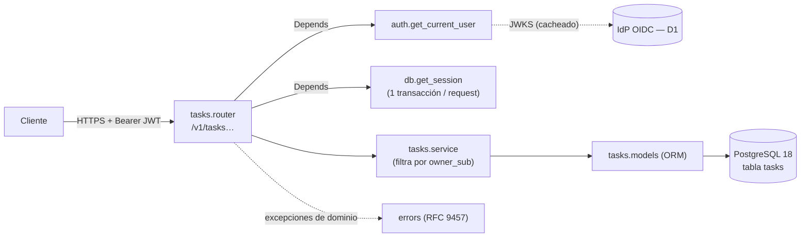

<!--
  PLANTILLA AI-DLC — design.md (canonical: .agents/templates/spec/)
  Se llena DESPUÉS de que requirements.md esté aprobado (o al menos
  estable). Aquí sí va el CÓMO: arquitectura, contratos, datos.

  GUARDRAILS:
  - Todo componente/abstracción nuevo debe justificarse con un R*.*
    o NFR concreto. Si ningún requirement lo exige, no va — o se
    declara en "Complejidad justificada".
  - Cruzar con stack/architecture.md y stack/constraints.md: el
    design no contradice el stack declarado del repo.
  - Decisiones con notación DEC-N (no D-N — reservado a Dependencies).
  - Registrar alternativas rechazadas: el "por qué no" vale tanto
    como el "por qué sí" (evita re-litigar en amendments).

  SECCIONES QUE NO APLICAN — dos casos distintos, y confundirlos
  le cobra la disciplina a quien no la declaró:

  a) La capacidad NO está declarada en repo-config.yaml (no hay
     `disciplines`, no hay tracker…) → la sección **SE BORRA ENTERA**.
     No se puede "considerar y descartar" una disciplina que el repo
     no tiene, y dejarla obliga a resolverla en G2 (check 0).
  b) La capacidad SÍ está declarada pero no aplica a ESTA feature →
     se marca `N/A — <razón>`.

  Regla corta: **capacidad no declarada se borra; capacidad declarada
  que no aplica se marca**. Las secciones condicionales llevan escrito
  de qué capacidad dependen.

  Para el caso (b), la marca va `N/A — <razón>`
  en una línea. Ejemplo: "## Observabilidad — N/A: no agrega
  endpoints ni jobs; la métrica existente cubre el cambio".
  Por qué marcar y no borrar: un design.md sin sección de Seguridad es
  ambiguo —¿se consideró y se descartó, o se olvidó?—. La marca deja
  escrito que se consideró, y es lo que `/spec-verify --pre-g2`
  (check 0) exige para firmar G2: toda sección resuelta, llena o N/A.
  Ojo: `N/A` no es un atajo. No se puede marcar N/A en Modelo de datos
  si algún R*.* persiste algo.
-->
# Design: Gestión de tareas personales

## Arquitectura

Servicio FastAPI en capas por módulo (`stack/architecture.md`): un único módulo
de dominio `tasks` más la infraestructura común (`config`, `db`, `auth`,
`errors`). Es la primera feature del repo, así que todos los componentes son
nuevos.



Flujo de una petición: `auth` valida el token y entrega el `sub`. El `router`
parsea la entrada, calcula "hoy" en UTC cuando hace falta y llama a `service`
con el `sub`. `service` hace todas las queries **siempre** con
`owner_sub = sub` y lanza `NotFoundError` si no hay fila. Por último, `errors`
traduce las excepciones a `application/problem+json`.

## Componentes

| Componente | Responsabilidad | Justificado por |
|---|---|---|
| `src/greenfield/main.py` | Crea la app, monta el router bajo `/v1`, registra handlers y el middleware de log | Wiring (todas las R) |
| `src/greenfield/config.py` | Lee `DATABASE_URL`, `AUTH_ISSUER`, `AUTH_AUDIENCE`, `AUTH_JWKS_URL`, `LOG_LEVEL` del entorno; falla al arrancar si falta alguna | R1.1, D1, `stack/constraints.md` (12-factor) |
| `src/greenfield/db.py` | Engine, `sessionmaker` y dependencia `get_session`: commit si todo sale bien, rollback si hay excepción | R4.5 (atomicidad), R4.7 |
| `src/greenfield/auth.py` | Dependencia `get_current_user` → `sub`; dependencia `get_key_resolver` (JWKS del IdP en producción, llave local en tests) | R1.1, R1.2, D1 (MOCK) |
| `src/greenfield/errors.py` | `NotFoundError`; handlers de `NotFoundError`, `RequestValidationError` y excepciones no controladas → RFC 9457 con lista `errors[{field, message}]` | R2.4–R2.7, R3.2, R3.5, R3.8, R4.5, R4.6, R5.2 |
| `src/greenfield/access_log.py` | Configura `logging` y un middleware de access log: método, ruta, status, duración en ms y `sub`. Nunca registra el cuerpo | NFR2, métrica de éxito (tasa de 5xx), `stack/security.md` § Auditoría |
| `src/greenfield/tasks/models.py` | Modelo ORM `Task` | R1.2, R2.1–R2.3, R5.1 |
| `src/greenfield/tasks/schemas.py` | `TaskCreate`, `TaskUpdate`, `TaskRead`, `PendingTaskRead` (+`is_overdue`), `TaskStatus` (enum), `Page[T]` | R2.2–R2.7, R3.1, R3.7, R4.1, R4.4, R4.5, R6.3 |
| `src/greenfield/tasks/service.py` | `create`, `get`, `list_tasks`, `update`, `delete`, `list_pending(today, overdue_only)` | R1.3, R1.4, R2.*, R3.*, R4.*, R5.*, R6.* |
| `src/greenfield/tasks/router.py` | Los 6 endpoints de § Contratos; parseo de `task_id` y cálculo de `today` | Todas las R de la API |
| `migrations/` (`env.py` + `versions/0001_create_tasks.py`) | DDL de § Modelo de datos | R1.2, R2.*, R6.2 (índices), NFR1 |
| `tests/unit`, `tests/integration`, `tests/conftest.py` | BD de pruebas vía `TEST_DATABASE_URL` (debe terminar en `_test`; migraciones al inicio, tablas vaciadas entre tests), `TestClient`, emisor de tokens de prueba (llave RSA generada) — AMD-001 | `stack/testing.md` |
| `tests/load/tasks.js` | Script k6: siembra 10 usuarios × 1.000 tareas y mide p95 con thresholds | NFR1 |

## Modelo de datos

```sql
CREATE TABLE tasks (
    id          uuid          PRIMARY KEY,                -- uuid4 generado por la app
    owner_sub   text          NOT NULL,                   -- R1.2: claim `sub` del token
    title       varchar(200)  NOT NULL CHECK (btrim(title) <> ''),     -- R2.4
    description varchar(2000),                            -- R2.5; NULL = sin descripción
    status      text          NOT NULL DEFAULT 'pending'
                CHECK (status IN ('pending', 'in_progress', 'completed')),  -- R2.2, R2.6
    due_date    date,                                     -- R2.7; NULL = sin fecha límite
    created_at  timestamptz   NOT NULL,
    updated_at  timestamptz   NOT NULL
);

-- R3.3: listado propio, orden por creación desc + id
CREATE INDEX ix_tasks_owner_created ON tasks (owner_sub, created_at DESC, id DESC);

-- R6.1/R6.2 + NFR1: pendientes por fecha límite (NULLS LAST por defecto en ASC)
CREATE INDEX ix_tasks_owner_pending ON tasks (owner_sub, due_date, created_at, id)
    WHERE status <> 'completed';
```

- Las validaciones de la app (Pydantic) son la fuente del error 422. Los `CHECK`
  son un respaldo por si alguien escribe directamente en la BD.
- `varchar(n)` en PostgreSQL cuenta caracteres, no bytes: es la misma regla de
  R2.4 y R2.5.
- El borrado es físico (`DELETE`), según R5.1. No hay columnas de borrado lógico.
- Migración `0001` reversible: su `downgrade()` borra la tabla. Sin backfill,
  porque la tabla es nueva.

## Contratos

### API

Base `/v1` (DEC-2). JSON en inglés (DEC-1). Todas las rutas exigen
`Authorization: Bearer <jwt>`. Sin token o con uno inválido → `401` +
`WWW-Authenticate: Bearer` (R1.1).

| Método y ruta | Entrada | Éxito | Errores | R*.* |
|---|---|---|---|---|
| `POST /v1/tasks` | body `TaskCreate` | `201` `TaskRead` + `Location: /v1/tasks/{id}` | `422` | R1.2, R2.1–R2.8 |
| `GET /v1/tasks` | query `status?`, `limit=50` (1–100), `offset=0` (≥0) | `200` `Page[TaskRead]` | `422` | R1.4, R3.3–R3.8 |
| `GET /v1/tasks/pending` | query `overdue=false`, `limit`, `offset` | `200` `Page[PendingTaskRead]` | `422` | R1.4, R6.1–R6.6 |
| `GET /v1/tasks/{task_id}` | — | `200` `TaskRead` | `404` | R1.3, R3.1, R3.2 |
| `PATCH /v1/tasks/{task_id}` | body `TaskUpdate` (parcial) | `200` `TaskRead` | `404`, `422` | R1.3, R4.1–R4.7 |
| `DELETE /v1/tasks/{task_id}` | — | `204` sin cuerpo | `404` | R1.3, R5.1, R5.2 |

```yaml
# Schemas (resumen OpenAPI; el documento completo lo genera FastAPI en /openapi.json)
TaskStatus: { type: string, enum: [pending, in_progress, completed] }
TaskCreate:            # extra fields → 422
  title:       { type: string, minLength: 1, maxLength: 200 }   # requerido; no sólo espacios
  description: { type: string, maxLength: 2000, nullable: true }
  status:      { $ref: TaskStatus, default: pending }
  due_date:    { type: string, format: date, nullable: true }  # AAAA-MM-DD
TaskUpdate:            # todos opcionales; ausente = no cambia; extra fields → 422
  title:       { type: string, minLength: 1, maxLength: 200 }   # null → 422
  description: { type: string, maxLength: 2000, nullable: true } # null → se quita
  status:      { $ref: TaskStatus }                              # null → 422
  due_date:    { type: string, format: date, nullable: true }   # null → se quita
TaskRead:
  id: uuid; title; description; status; due_date
  created_at: { type: string, format: date-time }   # UTC, con zona
  updated_at: { type: string, format: date-time }
PendingTaskRead: TaskRead + { is_overdue: boolean }   # due_date < hoy (UTC)
Page[T]: { items: T[], total: integer, limit: integer, offset: integer }
Problem (RFC 9457, application/problem+json):
  { type: "about:blank", title, status, detail?, errors?: [{ field, message }] }
```

**Equivalencia con los términos de `requirements.md`**: título = `title`,
descripción = `description`, estado = `status`, fecha límite = `due_date`,
vencida = `is_overdue`; `pendiente` = `pending`, `en_progreso` = `in_progress`,
`completada` = `completed`. Tarea pendiente = `status <> 'completed'`.

### Eventos

N/A — la feature no publica ni consume eventos.

### Contratos consumidos

| D-N | Contrato | Versión | Uso | Estrategia |
|---|---|---|---|---|
| D1 | OpenID Connect Core + JWKS (RFC 7517), id `oidc-core` | 1.0 | Validar la firma, `iss`, `aud`, `exp` y `sub` del Bearer | MOCK: en tests, llave RSA generada e inyectada con `get_key_resolver` |

## Decisiones (DEC-N)

- **DEC-1**: campos y valores del JSON en inglés, con la tabla de equivalencias
  de § API. Justifica todas las R de la API.
  - Alternativas: todo en español (rechazada por el dev en `/spec-design`, porque
    mezcla idiomas con el código y rompe la convención habitual de las APIs).
- **DEC-2**: prefijo de versión `/v1` en todas las rutas.
  - Alternativas: sin prefijo (rechazada: agregarlo después rompe a los clientes;
    hoy cuesta una línea).
- **DEC-3**: `PATCH` con semántica de actualización parcial usando
  `model_fields_set` de Pydantic. Un campo ausente no cambia (R4.1). `null` en
  `description` o `due_date` quita el valor (R4.4). `null` en `title` o
  `status` → 422 (R4.5). `extra="forbid"` evita que el cliente escriba `id`,
  `owner_sub` o las fechas de auditoría. Un `PATCH {}` devuelve la tarea sin
  tocar `updated_at` (R4.2 sólo aplica cuando hay modificación).
  - Alternativas: `PUT` de reemplazo completo (rechazada: R4.1 pide cambios
    parciales); JSON Merge Patch con otro media type (rechazada: a este tamaño,
    `model_fields_set` da la misma semántica).
- **DEC-4**: `task_id` se declara como `str` en la ruta y se parsea a UUID en el
  router. Un formato inválido da `404`, no el `422` automático de FastAPI (R3.2).
  `GET /v1/tasks/pending` se registra antes que `/{task_id}` para que la ruta
  estática gane.
- **DEC-5**: "hoy" = `datetime.now(UTC).date()`, calculado en el router y pasado a
  `service.list_pending(today=…)` (R6.3, R6.4). Los tests fijan la fecha
  pasándola como parámetro, sin librerías para congelar el reloj.
  - Alternativas: `current_date` de PostgreSQL (rechazada: depende del
    `TimeZone` de la sesión de BD y obliga a manipular el reloj de la BD en tests).
- **DEC-6**: la tarea ajena y la inexistente siguen el mismo camino de código:
  una sola query `WHERE id = :id AND owner_sub = :sub`. Ninguna rama distingue
  los dos casos, así que la respuesta es idéntica por construcción (R1.3).
- **DEC-7**: `status` como `text` + `CHECK` en lugar de un `ENUM` nativo de
  PostgreSQL (R2.6).
  - Alternativas: `CREATE TYPE … AS ENUM` (rechazada: agregar o quitar un valor
    exige `ALTER TYPE` con restricciones transaccionales; el `CHECK` se cambia en
    una migración normal).
- **DEC-8**: paginación `limit`/`offset` con `total` obtenido por un `COUNT(*)`
  con el mismo filtro (R3.7, R6.6).
  - Alternativas: paginación por cursor/keyset (rechazada: la spec pide paginar
    por posición y con total, y el volumen esperado por usuario son miles de
    filas, donde `OFFSET` no penaliza).
- **DEC-9**: concurrencia de última escritura (R4.7). Cada `PATCH` es cargar,
  modificar y confirmar dentro de una transacción `READ COMMITTED`, y el `UPDATE`
  sólo incluye las columnas cambiadas. No hay columna `version`.
  - Alternativas: control optimista con `ETag`/`If-Match` (rechazada por el dev
    en `/spec-clarify`).
- **DEC-10**: validación del JWT con `PyJWT` + `PyJWKClient`, que cachea el JWKS.
  Se aceptan sólo `RS256` y `ES256`, son obligatorios `exp`, `iss`, `aud` y
  `sub`, y la tolerancia de reloj es de 30 s (`stack/security.md`). La fuente de
  llaves es una dependencia inyectable (`get_key_resolver`), para que los tests
  firmen con una llave propia y ejerzan la validación real (R1.1, D1 en MOCK).
- **DEC-11**: NFR1 se mide con **k6** (`tests/load/tasks.js`), con thresholds
  `p(95)<300` en operaciones individuales y `p(95)<500` en listados. k6 falla la
  corrida si no se cumplen.
  - Alternativas: Locust (rechazada: dependencia Python nueva con muchas
    transitivas y sin thresholds incorporados).

### Dependencias nuevas (requieren OK en G2 — AGENTS.md § *Dependencias nuevas*)

| Paquete | Uso | Licencia | Cubre |
|---|---|---|---|
| `fastapi` (trae `pydantic`, `starlette`) | API y validación | MIT | todas las R |
| `uvicorn[standard]` | Servidor ASGI | BSD-3 | wiring |
| `sqlalchemy` 2.x | ORM | MIT | R1–R6 |
| `psycopg[binary]` 3.x | Driver PostgreSQL | **LGPL-3.0** — uso como librería no modificada: compatible | R1–R6 |
| `alembic` | Migraciones | MIT | Modelo de datos |
| `pyjwt[crypto]` (trae `cryptography`) | Validar el JWT | MIT / Apache-2.0 | R1.1 |
| *dev:* `pytest`, `pytest-cov` | Tests y cobertura | MIT | `stack/testing.md` |
| *dev:* `httpx` | Requerido por `TestClient` | BSD-3 | `stack/testing.md` |
| *dev:* `ruff`, `mypy`, `pip-audit` | Lint, tipos, auditoría de vulnerabilidades | MIT / MIT / Apache-2.0 | `stack/tech-stack.md` |
| *herramienta externa:* `k6` | Pruebas de carga | **AGPL-3.0** — binario aparte, no se enlaza ni se distribuye con el servicio | NFR1 |

`pip-audit` corre sobre el lockfile en la primera task de `/spec-implement`, antes
de dar las dependencias por buenas; el resultado se reporta.

## Complejidad justificada

Ninguna: cada componente responde a un `R*.*`, a un NFR o a `stack/`. No hay
repositorios, interfaces ni capas más allá de las de `stack/architecture.md`. Las
dos piezas que un revisor podría cuestionar ya tienen su justificación en la
tabla de Componentes: `get_key_resolver` (DEC-10: sin ella no se prueba la
validación real del token) y el middleware de log (métrica de éxito de 5xx).

## Despliegue

- `repo_type: service`. Flujo `pruebas → qa → main` (`repo-config.yaml`).
- **Runtime `TBD`** (`repo-config.yaml > runtime.type`, `stack/tech-stack.md`).
  La imagen de contenedor, los manifiestos, el health check y el límite de
  tamaño de body en el ingress se definen cuando se decida el runtime. Esto
  **bloquea `/spec-promote --to pruebas`, no la implementación**, y se resuelve
  a la vez que D1.
- Migraciones: `alembic upgrade head` como paso previo al arranque de cada
  despliegue.
- Local: instancia PostgreSQL 18 propia en el puerto 5433 (base `greenfield`; ver `README.md`) y `uvicorn greenfield.main:app` (AMD-001).

### Configuración

| Variable | Origen | Notas |
|---|---|---|
| `DATABASE_URL` | Secreto (gestor por definir con el runtime; `.env` en local) | `postgresql+psycopg://…`; nunca en el repo |
| `AUTH_ISSUER` | Config por ambiente | `iss` esperado (D1) |
| `AUTH_AUDIENCE` | Config por ambiente | `aud` esperado (D1) |
| `AUTH_JWKS_URL` | Config por ambiente | URL del JWKS del IdP (D1) |
| `LOG_LEVEL` | Config por ambiente | Default `INFO` |
| `TEST_DATABASE_URL` | Sólo pruebas (`.env` en local, secreto del pipeline en CI) | El nombre de la base debe terminar en `_test` (AMD-001) |

Se commitea `.env.example` sólo con los nombres de las variables.

## Seguridad

- **Auth**: Bearer JWT de un IdP OIDC externo (DEC-10). El servicio no guarda
  credenciales ni secretos de firma.
- **Autorización**: por propiedad. Toda query lleva `owner_sub = sub` (DEC-6) y
  lo ajeno responde `404`. Cubre R1.3 y R1.4 y es el anti-patrón nº 1 de
  `AGENTS.md`.
- **Datos sensibles / PII**: `title` y `description` pueden traer datos
  personales. El middleware de log no registra cuerpos (NFR2) y sólo guarda IDs
  y el `sub` seudónimo.
- **Threat model**:
  - Token falsificado o confusión de algoritmo → lista cerrada `RS256`/`ES256`;
    se rechazan `none` y `HS*`.
  - Token de otro servicio → `aud` obligatorio.
  - IDOR y enumeración de IDs → filtro por dueño, `404` uniforme y UUID v4 no
    secuencial.
  - Asignación masiva de campos → `extra="forbid"`; `owner_sub` e `id` nunca
    salen del body.
  - Inyección SQL → sólo el ORM con parámetros bind.
  - Respuestas enormes → `limit` ≤ 100.
  - Bodies enormes → límites de longitud por campo; el límite de bytes en el
    ingress llega con el runtime.
- **Vulnerabilidades**: `pip-audit` en CI (`stack/security.md`).

## Observabilidad

- **Métricas**: no hay stack de métricas (`stack/patterns.md`). La tasa de 5xx
  (métrica de éxito) y las latencias se calculan con el access log. NFR1 se
  verifica con k6 (DEC-11).
- **Logs**: `logging` a stdout. Una línea por request con método, ruta, status,
  duración en ms y `sub`. Las excepciones no controladas se registran en `ERROR`
  con stack trace, y el cliente sólo recibe un 500 genérico. Nunca se registran
  `title`, `description`, headers `Authorization` ni tokens (NFR2).
- **Alertas**: N/A — sin runtime ni herramienta de monitoreo decididos. Se
  definen junto con el deploy target.

## Conflicts resolved

N/A — no hay otras specs en el repo; el conflict scan de `/spec-new` no encontró conflictos.
